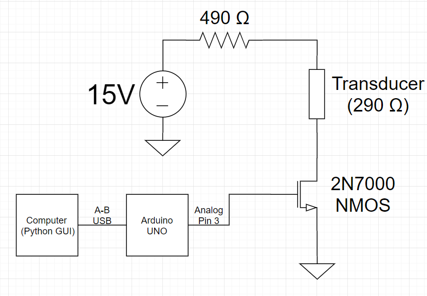
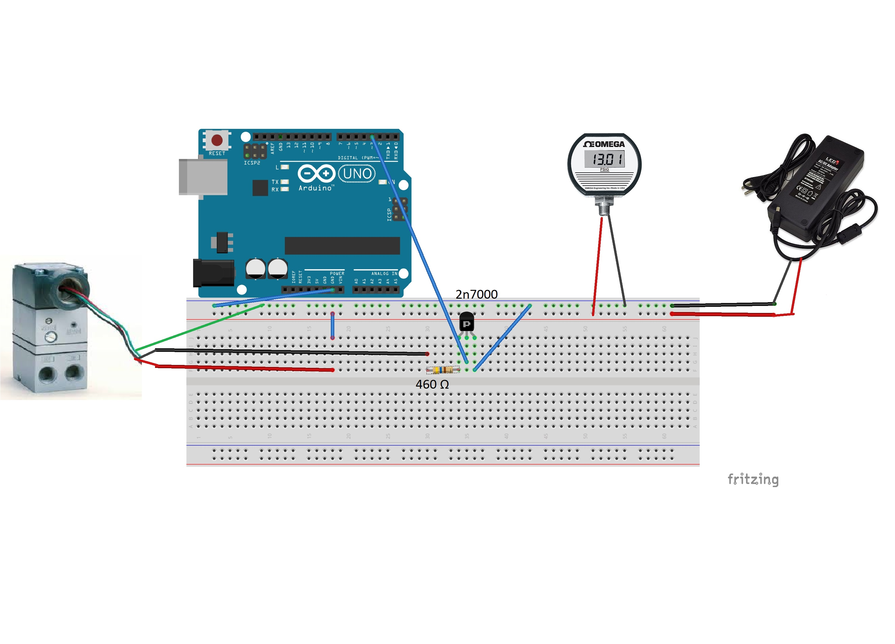
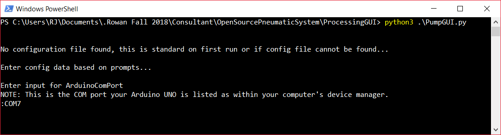
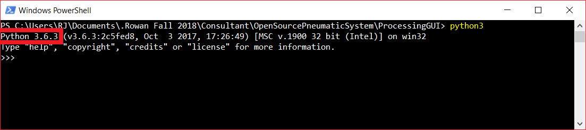

# Open-source, Arduino-based pneumatic system for Dr. Galie's lab at Rowan University
### This project is a modified version of the [MillerLab Pneumatic System](https://github.com/MillerLabFTW/OpenSourcePneumaticSystem)

Developed and documented by R.J. Weld and Kishan Patel

## Overview
This is an open-source pneumatic control system utilizing an Arduino UNO and the 
Python 3 programming language. Python is used for GUI control which sends signals 
to the Arduino via serial port. Arduino reads these signals and outputs accordingly 
for the transducer.

More specifically, Python 3.6.3 was used in the development of this project 
and is the version that will be outlined for setup within this document.
Other Python 3 subversions (any 3.x.x) will most likely work but have not been tested.

## Repository Contents
1. [Bill of materials for this project](#bill-of-materials)
2. [Python 3.6.3 setup](#python-3.6.3-setup)
3. [Arduino UNO setup](#arduino-uno-setup)
4. [Repository setup](#repository-setup)
5. [Schematic for electronics connectivity and setup](#schematics)
6. [GUI and System Usage](#gui-and-system-usage)
7. [Possible future work](#possible-future-work)
8. [Troubleshooting](#troubleshooting)
9. [Additional Documentation](#additional-documentation)

## Bill of materials
The complete Bill-of-Materials for this [Arduino](https://www.arduino.cc/)-based 
system are provided in the document `Pneumatic System Bill of Materials` located 
in the `docs` directory of this repository. Currently, required items are roughly $500 and the grand 
total for all recommended items (including the required items) is roughly $1,100.

## Python 3.6.3 setup
1. Download the [Python 3.6.3](https://www.python.org/downloads/release/python-363/) 
executable installer for your computer. For 32-bit computers, download the x86 
version and for 64-bit computers, download the x86-64 version.
    1. Run installer, check "Add Python to PATH" and select custom installation
    2. Keep all Optional Features default and press next
    3. Under Advanced Options check "Add Python to environment variables" and press install.
2. Open Powershell or Command Terminal and enter "python"
    1. If python session starts you have set it up correctly and can continue to step 4.
    2. If command is not recognized try running ```python3``` instead in the terminal.
    3. If neither commands are recognized continue to next step.
3. Follow the steps in [this StackOverflow post](https://stackoverflow.com/questions/3701646/how-to-add-to-the-pythonpath-in-windows/32609129#32609129) 
for how to add Python to environment 
variables. This will allow you to run python scripts from command line. 
    1. *NOTE: This post was written for python 2.7 so you will have to figure out 
what directory Python was installed to on your computer. It may have defaulted to
C:\Users\YOURUSER\AppData\Local\Programs\Python\Python36*
    2. Retry commands run in step 2 and they should now work.
4. Open command prompt and enter ```pip3```
    1. If command is recognized and large help prompt is output, continue to step 5.
    2. If command is not recognized, enter ```where pip```
        - If there is a resulting path or more than one path, ensure that a python3 folder is within the first resulting path and continue to step 5.
        - If a python2 folder is in the first resulting path, go to subbullet iii below.
    3. Copy and paste the following commands, entering them into the command line
        - ```curl https://bootstrap.pypa.io/get-pip.py -o get-pip.py```
        - ```python3 get-pip.py```
5. Navigate to the root of this repo within the command terminal *NOTE: You will need to follow download instructions in [repository setup](#repository-setup) section before this is possible.*
    1. This can be done using ```cd [NextDirectoryName]``` to move to the next folder or ```cd ..``` to move back a folder
    2. Likewise, you can copy the repo root directory from the file explorer and paste to ```cd [PastedRepoPath]```
6. To install the required packages there are two ways this can be done...
    - Easier method
        - Double click [install_packages.bat](install_packages.bat)
            1. Command line should open up and run command for installing packages
        - If previous step did not work, open the file with notepad
            1. Change `pip3` to `pip`
            2. Save the file then double click it again.
        - If both methods failed, move on to harder method below
    - Harder method incase easier method fails
        - Use pip or pip3, whichever command worked from step 4 and run...
            1. ```pip3 install -r requirements.txt``` in command prompt
7. The python setup should only have to be done once per computer using the system. 

## Arduino UNO setup
1. Download the latest version of Arduino for your OS from [https://www.arduino.cc/en/Main/Software](https://www.arduino.cc/en/Main/Software). 
1. Connect Arduino UNO to your computer via USB connection and open Arduino IDE.
1. On the Arduino taskbar, navigate to `Tools`->`Board` and select `Arduino Uno`. Next, navigate to `Tools`->`Port` and select the port assigned to Arduino.
On Windows, the correct COM port can be determined by locating `Arduino Uno` under the `Ports` dropdown in Device Manager.
2. We recommend using the blink sketch included in the Arduino software to test the connection to Arduino. To do this, follow `File`->`Examples`->`01.Basics`->`Blink`.

### Uploading PneumaticFirmware to Arduino
1. Open `PneumaticFirmware.ino` in Arduino and upload to Arduino using the upload button. 

## Repository setup
1. Navigate to [this README's repo](https://github.com/rjweld21/OpenSourcePneumaticSystem)
2. Click the large green "Clone or Download" button
3. Click...
    - If you only plan on using this system, press "Download ZIP"
    - If you plan on making changes and further developing system...
        1. Copy SSH link
        2. Download Git
        3. Open Git Bash
        4. Navigate to directory where you want to download repository
        5. Enter `git clone [COPIED LINK]`
        6. Files should now be copied onto your computer
            - If you are unfamiliar with git, please look up general usage 
            before trying to make changes to the repo. Git is a great 
            tool but can be rather confusing at times. General usage is 
            easy to understand but git's lack of error details can make 
            it hard.
        7. Continue to step 5.
4. Within file explorer, navigate to where repo ZIP file was downloaded and extract its contents to your desired file location
5. Install python libraries (steps 4 - 6 of [Python 3.6.3 setup](#python-3.6.3-setup))
6. Open command prompt and navigate to "ProcessingGUI" directory of repo
7. Run ```python3 PumpGUI.py```
    1. Alternatively, with Windows, double clicking the "run.bat" file within the "ProcessingGUI" directory will launch the python script
    2. If ```python3``` does not work for you, you will need to right-click and open the "run.bat" file with notepad, change "python3" to "python"
    on the first line, save the file then re-run the batch script
        - If ```python3``` does not work for you but ```python``` does, the original "run.bat" will simply open and close the command prompt

## Schematics
The Omega Miniature I/P transducer (Model No. IP610-030) is rated for 4-20 mA of current. According to the datasheet, the transducer represents 290
\omega of impedance, thus we need 5.8 V maximum. The arduino genuino uno cannot produce this voltage, and thus an external power
supply is used to supply it. The transducer is hooked up in series, along with a current limiting resistor, in a low-side switch
configuration. The schematic can be seen below.


It is imperative that the datasheet of the transistor (2n7000) is consulted, in order to make sure that it is hooked up properly.
The source of the NMOS should be hooked to ground, the gate should be connected to the output of the arduino, and the drain should
be hooked up in series with the transducer, current limiting resistor (460 \omega) and the power supply. The following is a step-by-step
process of how to do this. Note: Please ensure that nothing is plugged in when hooking the circuit up.
1. Conenct positive of power supply to positive rail on breadboard.
2. Hook negative of power supply to negative rail on breadboard.
3. Use jumper cable to connect one end of the resistor to the positive rail.
4. Connect other end of resistor to the positive of the transducer.
5. Connect negative of transducer to the drain of the NMOS transistor
6. Use jumper cable to connect source of NMOS transistor to ground (negative rail of breadboard)
7. Use jumper to connect Analog pin 3 of Arduino to gate of NMOS transistor.
8. Use jumper cable to connect ground of Arduino to negative rail of breadboard.

In addition, the following is an example of the breadboard layout.



## GUI and System Usage
#### Once all previous sections are complete, follow the below steps for using this system 

##### GUI Usage
1. Easy method
    1. Navigate to ProcessingGUI directory with File Explorer 
    2. Double click "run.bat" file
        - This should open a command prompt which runs the necessary command to run the 
        python script.
        - If this fails saying python3 command does not exist, open "run.bat" with a 
        text editor, like Notepad, and change "python3" to "python".
        - If this fails as well, you will need to ensure Python 3 is set up correctly 
        and callable from command line.
    3. If command line opens and does not return error, continue to step 3 below. 
        
2. More complicated method in case easy method does not work 
    1. Open a command or powershell terminal 
    2. Navigate to the directory with PumpGUI.py within it 
        - You can use `cd [directory_to_go_to]` to enter the next folder in a path or `cd ..` to 
        go back a folder
        - You can use `dir` or `ls` to check the contents of the current folder. If PumpGUI.py is 
        within the list, you are in the right directory.
    3. Enter `python3 PumpGUI.py` or `python PumpGUI.py` depending on which python call works 
3. Upon first run, configuration settings will need to be entered 
        - Currently, there is only one field to be filled out and that is for the Arduino COM port 
        - With your Arduino UNO plugged in, open Device Manager
        - Within Device Manager, find "Ports (COM & LPT)" dropdown list.
        - Expand the list and find the COM port associated with your Arduino UNO 
        - Enter this COM port when prompted by python. For example, if your Arduino is 
        at COM7, enter "COM7" when asked by python. See example below.

4. NOTE 1: If command line is closed, GUI will close as well so keep command line open 
for as long as you intend on using GUI.
5. NOTE 2: As long as Arduino has power, it will continue to output same signal 
for last recieved data. 
6. NOTE 3: If feedback signals are being sent to Arduino (which as of Fall 2018 
they are not) do NOT poweroff Arduino before powering down rest of system. This 
could break your Arduino.

## Possible Future Work
#### Areas for advancement which can be created into future ECE consultant projects 
1. Pressure feedback signals and control system
    - The digitial pressure gauge used in this project has analog feedback wires. 
    These wires can be used to give feedback about the actual pressure output 
    to the Arduino and a PID controller can be implemented into the Arduino 
    firmware. There are PID libraries for Arduino so this aspect should not be 
    terribly hard if you know how PID controllers work.
2. Embed circuit into PCB
    - Considering the circuit for this project has already been created, creating 
    a PCB layout for the circuit would not be too hard. This part should be done 
    as early as possible in the semester so designs can be handed into the tech 
    office and the boards can be recieved in a timely mannor. 
    - Consultants should ensure that they leave space and create through-holes 
    for prototyping advancements for the circuit. 
    - Arduino UNO gives an advantage here as well since the ATMega chip can be taken 
    off of the board and plugged into the PCB. An adapter should be used in this 
    case on the board for plugging in the ATMega chip rather than soldering it 
    directly to the board.
        - If this is done, JTAG pins should also be created on the board for 
        easier programming of the chip and less chance of the chip breaking 
        while swapping it between the PCB and Arduino UNO dev board.
3. 3-D Printed Enclosure
    - This could be done by a MechE student who works with the ECE students 
    to understand the specs required of the enclosure or just an ECE student 
    who has knowledge/wants to learn how to 3-D print.
    - This step should be done AFTER a PCB is created for the system
    - This would clean up the wires and make the circuit more durable and 
    less likely to harm the BME users. 
    
## Troubleshooting
#### This section includes possible problems anticipated by the developers that users may run into but not know how to solve

1. PROBLEM: When starting up Python GUI, serial port cannot be connected to Arduino.
    - DIAGNOSE: Ensure Arduino is connected to computer.
        1. Go into Device Manager 
        2. Find Arduino UNO in "Ports (COM & LPT)"
        3. SOLUTION: If Arduino is not found to be recognized but is plugged in, unplug and 
        plug back in. If problem still occurs, Google will be your friend for finding solutions 
        to this problem. On very rare occasions, Arduinos get corrupted when being programmed and essentially 
        become useless. Replacing the Arduino may be the solution but solutions on Google should 
        be tried first to avoid buying another Arduino if it is fixable.
    - DIAGNOSE: Ensure correct COM port is set in Python config file.
        1. Go to "content" folder within ProcessigGUI directory
        2. If config file has been set up there will be a file named "ard.config" or just "ard" 
         (depending on if you have File Explorer set up to show file extensions). Either delete this
         file or rename it to something else.
        3. Re-run the GUI (following instructions under [GUI Usage](#gui-usage))
        4. SOLUTION: You will be prompted to input config information, enter COM port 
        associated with your Arduino found within Device Manager
        
1. PROBLEM: Python language is saying there are syntax errors
    - DIAGNOSE: Ensure a Python 3 subversion is used to run PumpGUI.py
        1. Open command prompt or powershell
        2. Enter `python` or `python3` based off of which command you have been using to run python
        3. If python terminal runs, check that it is running on a Python 3 version
            - Version can be found in the place that is outlined in red in the picture below.
        4. SOLUTION: If command is not recognized or Python 2 version runs, ensure that Python 3 is installed
        and set up command to run Python 3. Google will help a lot here. Really the hardest part with Python is
        the setup.

    - DIAGNOSE: If Python 3 version is confirmed to run with steps above, you may need to install
    required packages with pip connected to Python 3.
        1. Open command prompt or powershell
        2. Enter `pip -V` or `pip3 -V` based off of which command you have been using to install packages.
        3. SOLUTION: If first resulting path is not connected to Python 3, Google will need to be used to figure out how to
        connect pip command to correct Python version.
        4. SOLUTION: If pip is connected to correct Python version, navigate to OpenSourcePneumaticSystem 
        directory and double click "install_packages.bat". If error is shown saying pip3 is not recognized, open
        "install_packages.bat" with Notepad and change "pip3" to "pip", save and re-run.
    
# Additional Documentation
Additional documentation that may be needed for the setup, troubleshooting or further 
development of this project can be found within the [docs](docs/) directory. Here, 
some data sheets can be found along with the bill of materials and the Fall 2018 
presentation done for this project.